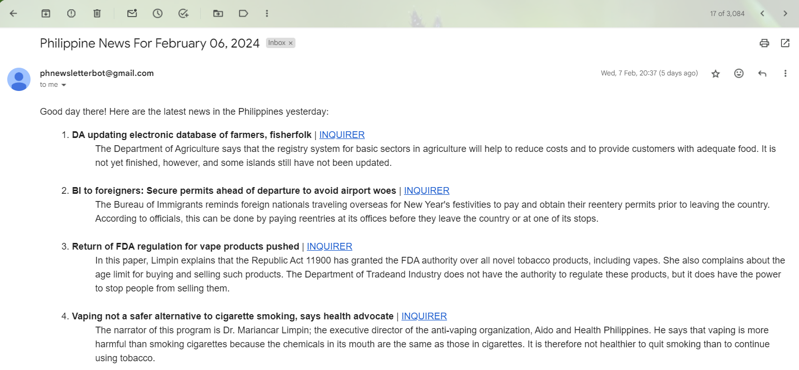

# 📰 News Summarizer Bot


This project creates a News Summarizer Bot that does the following:
- Scrapes latest news date in various Philippine news websites
- Summarizes all scraped news data using LLM
- Sends newsletter daily containing the summarized news of the previous day in Gmail
- Stores all newsletter info in AWS DynamoDB

**Initial preview:**


## Installation

 Clone the repository by ``` git clone https://github.com/ejcrusina/News-Summarizer-Bot.git```

## Usage

1. Change the daily sending schedule in CRON expression of ```.github\workflows\actions.yml``` and user accounts in:
   - Gmail
   - AWS Service - Need separate setup of DynamoDB table. The code ensures table usage remains within free tier
2. Set the git and the repository in your Github actions settings.
3. Run ```main.py``` in your environment, until the last specified date.

## License
[MIT](https://choosealicense.com/licenses/mit/)
